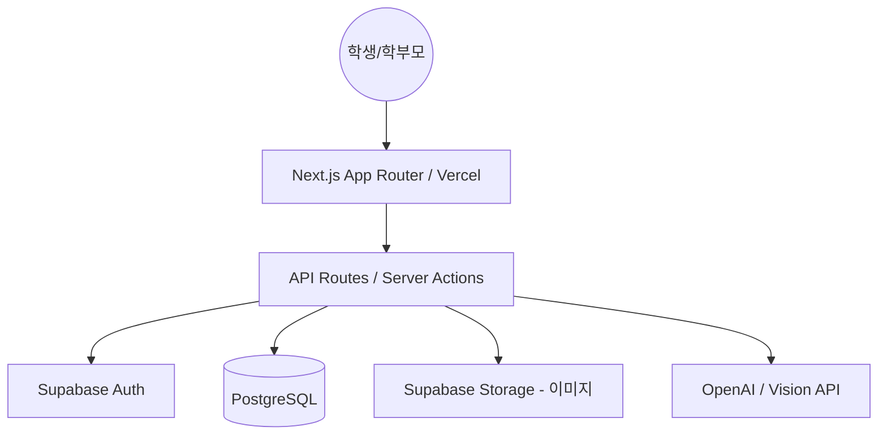

# [Step 10] 시스템 아키텍처 설계: 루프노트 (LoopNote)

> 확장 가능하고 견고한 루프노트 전체 시스템 구조

**Status**: Approved
**Created**: 2026-05-26
**Owner**: Gemini (Review Agent)

---

## 1. 아키텍처 개요
루프노트는 **Next.js의 Full-stack 기능을 활용한 모놀리식 지향 구조**를 채택합니다. 초기 개발 속도와 배포 편의성을 위해 Supabase BaaS를 적극 활용합니다.

---

## 2. 시스템 컴포넌트 다이어그램 (Concept)

---

## 3. 핵심 아키텍처 원칙
1.  **Serverless First**: 서버 관리 비용을 최소화하기 위해 Vercel Edge Functions 및 Supabase를 활용합니다.
2.  **Edge-side Logic**: 실시간 힌트 생성 및 피드백은 Edge 런타임에서 처리하여 지연 시간을 최소화합니다.
3.  **데이터 무결성**: 모든 학습 데이터 및 오답 이력은 PostgreSQL의 RLS(Row Level Security)를 통해 사용자별로 철저히 격리합니다.

---

## 4. 통신 프로토콜
*   **Client ↔ Server**: JSON 기반 RESTful API 및 Server Actions.
*   **Server ↔ AI**: Streaming API (힌트 생성 시 글자가 타이핑되듯 보여주기 위함).
*   **Real-time**: Supabase Realtime (학부모 대시보드 실시간 알림용).
